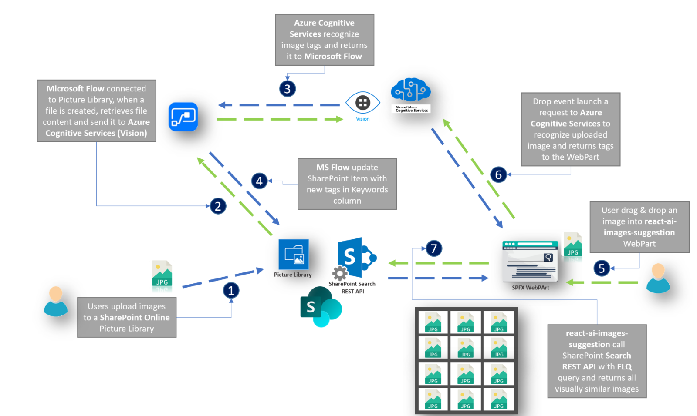

# react-ai-images-suggestion

## Summary
A spfx webpart that to upload an image (using open source library [react-dropzone](https://github.com/react-dropzone/react-dropzone)) and immediatly search for visually similar images inside an Image Library, using [Azure Cognitive Services](https://azure.microsoft.com/en-us/services/cognitive-services/computer-vision/) and [SharePoint Search REST API](https://docs.microsoft.com/en-us/sharepoint/dev/general-development/sharepoint-search-rest-api-overview). 
Keywords of the images in the library are enriched during upload thanks to a Microsoft Flow connected to the Azure Cognitive Services (thanks to [rasper87](https://rasper87.wordpress.com/2018/05/11/sharepoint-auto-tagging-with-ai-and-flow/) for the inspiration, steps 1/4 in the architecture)

## Architecture

## react-ai-images-suggestion SPFX WebPart in action!

## Microsoft Flow configuration with Azure Cognitive Services

## Used SharePoint Framework Version 

## Applies to

* [SharePoint Framework](https://dev.office.com/sharepoint)
* [Office 365 tenant](https://dev.office.com/sharepoint/docs/spfx/set-up-your-development-environment)

> Update accordingly as needed.

## Prerequisites
 
> n.a.

## Solution

Solution|Author
--------|---------
react-ai-images-suggestion | [Federico Porceddu](https://www.federicoporceddu.com)

## Version history

Version|Date|Comments
-------|----|--------
1.0|March 8, 2019|Initial release

## Disclaimer
**THIS CODE IS PROVIDED *AS IS* WITHOUT WARRANTY OF ANY KIND, EITHER EXPRESS OR IMPLIED, INCLUDING ANY IMPLIED WARRANTIES OF FITNESS FOR A PARTICULAR PURPOSE, MERCHANTABILITY, OR NON-INFRINGEMENT.**

---

## Minimal Path to Awesome

- Clone this repository
- Move to right solution folder 
- in the command line run:
  - `npm install`
  - `gulp serve`

## Features
This webpart illustrates the following concepts:

- Microsoft Flow
- Azure Cognitive Services
- topic 3

# react-ai-images-suggestion
