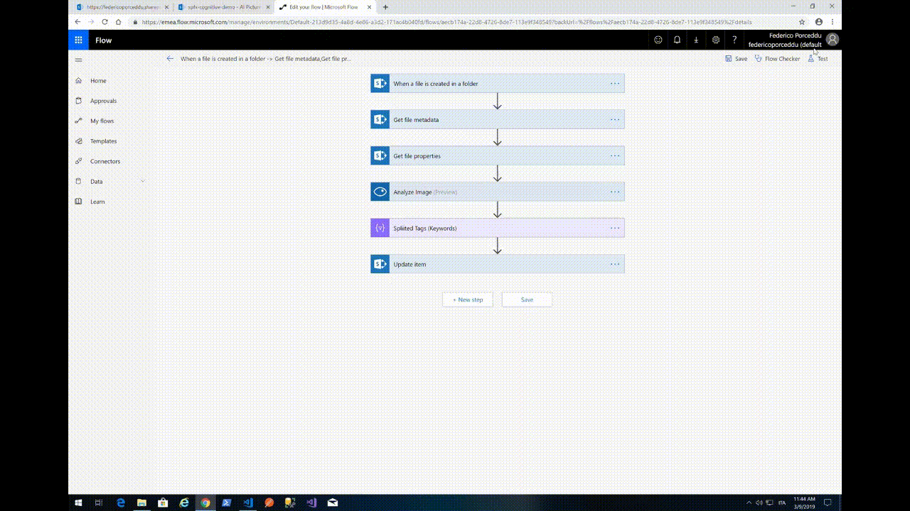
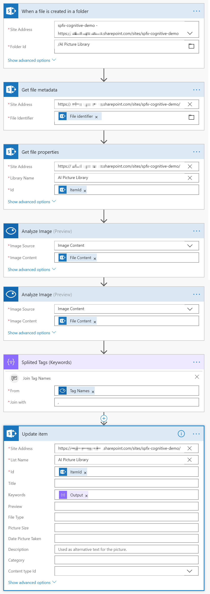

# react-cs-images-suggestion

## Summary
A SPFX webpart using the open source library [react-dropzone](https://github.com/react-dropzone/react-dropzone) to upload an image and immediately search for visually similar images inside a SharePoint Online Picture Library, by the employment of [Azure Cognitive Services - Computer Vision](https://azure.microsoft.com/en-us/services/cognitive-services/computer-vision/) and [SharePoint Search REST API](https://docs.microsoft.com/en-us/sharepoint/dev/general-development/sharepoint-search-rest-api-overview). 
Keywords of the images in the library are enriched during upload thanks to a Microsoft Flow connected to the Azure Cognitive Services Computer Vision (thanks to [rasper87](https://rasper87.wordpress.com/2018/05/11/sharepoint-auto-tagging-with-cs-and-flow/) for the inspiration, steps 1-4 in the architecture)

## Architecture

## react-cs-images-suggestion SPFX WebPart in action!

## Microsoft Flow in action!

## Microsoft Flow configuration with Azure Cognitive Services

## Used SharePoint Framework Version 

## Applies to

* [SharePoint Framework](https://dev.office.com/sharepoint)
* [Office 365 tenant](https://dev.office.com/sharepoint/docs/spfx/set-up-your-development-environment)

## Prerequisites
 
* Azure Subscription

## Solution

Solution|Author
--------|---------
react-cs-images-suggestion | [Federico Porceddu](https://www.federicoporceddu.com)

## Version history

Version|Date|Comments
-------|----|--------
1.0|March 8, 2019|Initial release

## Disclaimer
**THIS CODE IS PROVIDED *AS IS* WITHOUT WARRANTY OF ANY KIND, EITHER EXPRESS OR IMPLIED, INCLUDING ANY IMPLIED WARRANTIES OF FITNESS FOR A PARTICULAR PURPOSE, MERCHANTABILITY, OR NON-INFRINGEMENT.**

---

## Minimal Path to Awesome

- Clone this repository
- Move to right solution folder 
- in the command line run:
  - `npm install`
  - `gulp serve`
- create Azure Cognitive EndPoint, change the key into cognitiveServicesKey 
- create AI Picture Library into your Modern Team Site
- create MS FLow following Microsoft Flow configuration with Azure Cognitive Services instructions
- Upload images, let's SharePoint crawler run (some minutes)

## Features
This webpart illustrates the following concepts:

- Microsoft Flow
- Make a post to Azure Cognitive Services with [PnP/PnPjs](https://github.com/pnp/pnpjs)
- [@pnp/sp/search](https://github.com/pnp/pnpjs/blob/dev/packages/sp/docs/search.md)
- [FAST Query Language (FQL)](https://docs.microsoft.com/en-us/sharepoint/dev/general-development/fast-query-language-fql-syntax-reference)
- [Azure Cognitive Services](https://azure.microsoft.com/en-us/services/cognitive-services/computer-vision/)
- [react-dropzone](https://github.com/react-dropzone/react-dropzone)
- [Office UI Fabric React Component List](https://developer.microsoft.com/en-us/fabric#/components/list#Variants)

